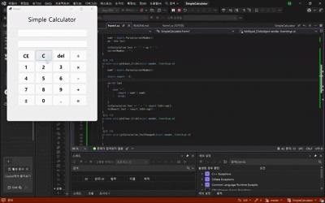
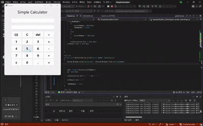

# (C# 코딩)Simple Calculator

## 개요
- C# 프로그래밍 학습
- 1줄 소개: 입력받은 숫자와 연산기호를 활용하여 계산을 해주는 간단한 계산기 프로그램
- 사용한 플랫폼:
- C#, .NET Windows Forms, Visual Studio, GitHub
- 사용한 컨트롤:
- Label, TextBox, Button
- 사용한 기술과 구현한 기능:
- Visual Studio를 이용하여 UI 디자인
- TextBox를 통해 사용자로부터 숫자와 연산기호 입력 받기
- Button 클릭 이벤트를 통해 계산 로직 구현
- int.parse() 메서드를 사용하여 문자열을 숫자로 변환
- ToString() 메서드를 사용하여 결과를 문자열로 변환하여 출력

## 실행 화면 (과제1)
- 과제1 코드의 실행 스크린샷

- 과제 내용
- TextBox(입력표시, 결과표시), Button(계산) 등을 적절히 배치합니다.
- 숫자 Button 클릭 시 TextBox에 표시합니다. 2가지 방법으로 표시
- 2개의 피연산자의 입력값을 Int로 바꾸어 더하기 계산을 수행하고 그 결과를 저장합니다.
- 계산 결과 값을 문자열로 변환하여 표시합니다.

- 구현 내용과 기능 설명
	- 숫자 버튼들을 한 번에 묶어서 임의로 지정한 NumberButton_Click 핸들러에 연결해서 미리 지정한 스트링 타입의 currentNumber라는 변수에 버튼의 텍스트가 저장되도록 하였고, txtCalculation.Text += btn.Text; 코드를 통해 저장된 문자열이 나타나도록 구현하였다.
	- 연산 기능은 먼저 num1, num2라는 int형 변수를 선언하여 각각 첫 번째 피연산자와 두 번째 피연산자를 intParse()메서드를 통해 int 형태로 저장하도록 하였고, = 버튼의 클릭 핸들러에 switch문을 이용하여 계산이 수행되도록 구현하였다. 계산된 결과는 txtCalculation.Text += " = " + result.ToString();코드로 윗줄에 연산과 결과, 아래줄에 txtResult.Text = result.ToString();결과만 나타나도록 구현하였다. 여기서 ToString() 메서드를 사용하여 int형인 result를 문자열로 변환하여 출력하도록 하였다. 
	또, switch문을 이용한 이유는 다른 연산들도 수월하게 구현이 가능하기 때문이다. = 핸들러의 코드는 다음과 같다.
	- private void btnEqual_Click(object sender, EventArgs e)
        {
            num2 = double.Parse(currentNumber);

            double result = 0;

            switch (op)
            {
                case "+":
                    result = num1 + num2;
                    break;
                
            }
            txtCalculation.Text += " = " + result.ToString();
            txtResult.Text = result.ToString();
        }

        ## 실행 화면 (과제2)
- 과제2 코드의 실행 스크린샷

- 과제 내용
- 1. 뺄셈(-), 곱셈(*), 나눗셈(/) 버튼 추가
2. 이벤트 연결
- 구현 내용과 기능 설명
  - 각각의 연산기호들을 OperatorButton_Click이라는 핸들러에 연결하여 currentNumber에 저장된 숫자와 연산기호를 각각 num1과 op라는 변수에 저장하도록 구현하였다. 그리고 = 버튼의 핸들러에서 switch문을 이용하여 각각의 연산이 수행되도록 구현하였다. 코드는 다음과 같다.
  - private void OperatorButton_Click(object sender, EventArgs e)
        {
            System.Windows.Forms.Button btn = (System.Windows.Forms.Button)sender;

            

            num1 = double.Parse(currentNumber);
            op = btn.Text;

            txtCalculation.Text += " " + op + " ";

            txtResult.Text = "";

            isNewNumber = true;
        }

        private void btnEqual_Click(object sender, EventArgs e)
        {
            num2 = double.Parse(currentNumber);

            double result = 0;

            switch (op)
            {
                case "+":
                    result = num1 + num2;
                    break;
                case "-":
                    result = num1 - num2;
                    break;
                case "×":
                    result = num1 * num2;
                    break;
                case "÷":
                    if (num2 == 0)
                    {
                        MessageBox.Show("0으로 나눌 수 없습니다!");
                        return;
                    }
                    result = num1 / num2;
                    break;

            }
            txtCalculation.Text += " = " + result.ToString();
            txtResult.Text = result.ToString();
            currentNumber = result.ToString();
            isNewNumber = true;
        }

  ## 실행 화면 (과제3)
- 과제3 코드의 실행 스크린샷

- 과제 내용
- C 버튼
- Del 버튼
- CE 버튼
- 
- 구현 내용과 기능 설명
- c버튼의 클릭 핸들러를 이용하여 txtCalculation.Text와 txtResult.Text를 초기화하도록 구현하였다. del 버튼의 클릭 핸들러에서는 currentNumber의 마지막 문자를 제거하도록 구현하였다. ce 버튼의 클릭 핸들러에서는 currentNumber를 초기화하도록 구현하였다. 각각의 코드는 다음과 같다.
-  private void btnClear_Click(object sender, EventArgs e)
        {
            txtCalculation.Text = "";
            txtResult.Text = "";
            currentNumber = "";
            num1 = 0;
            num2 = 0;
            op = "";
        }

- private void btnDel_Click(object sender, EventArgs e)
        {
            // 현재 입력값이 있을 때만
            if (txtResult.Text.Length > 0 && txtCalculation.Text.Length > 0)
            {
                txtResult.Text = txtResult.Text.Substring(0, txtResult.Text.Length - 1);
                txtCalculation.Text = txtCalculation.Text.Substring(0, txtCalculation.Text.Length - 1);
            }
        }

- private void btnCE_Click(object sender, EventArgs e)
        {
            txtResult.Text = "";   
            currentNumber = "";  
        }